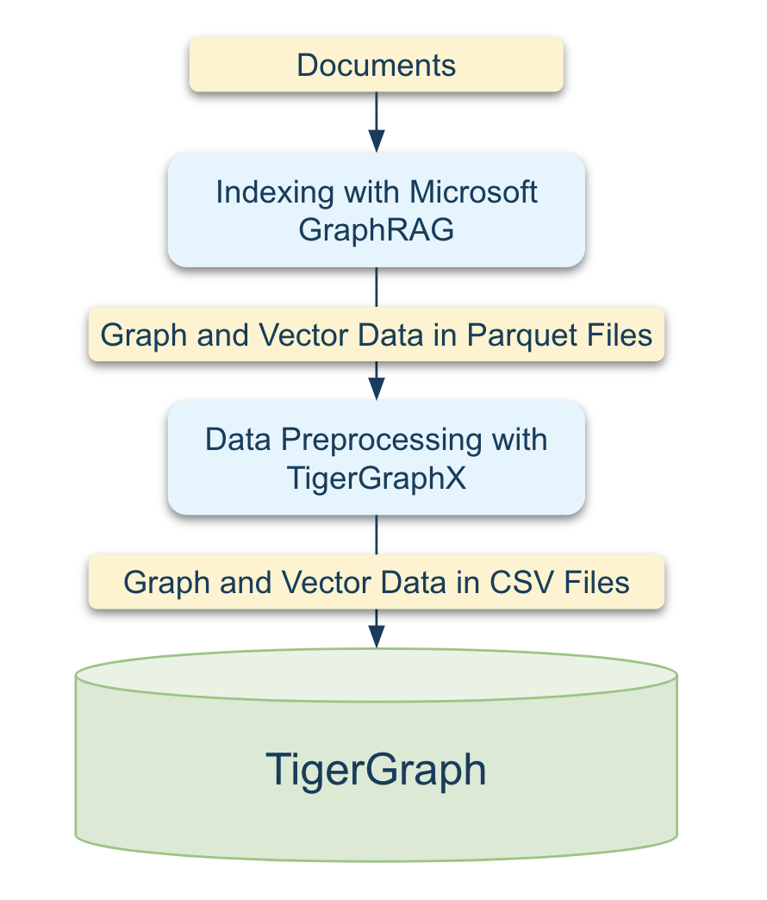

# Supporting Microsoft’s GraphRAG: Part 1

[Microsoft's GraphRAG](https://microsoft.github.io/graphrag/) is a method for creating structured knowledge graphs from raw text, enhancing Retrieval Augmented Generation (RAG) tasks. By organizing information hierarchically, it enables more efficient data retrieval and summarization.

## What You’ll Learn in This Guide

- **Indexing**: Utilize **Microsoft's GraphRAG** to convert unstructured documents into Parquet files.
- **Data Preprocessing**: Learn how to use utility methods provided by **TigerGraphX** to transform Parquet files into CSV files compatible with TigerGraph.
- **Schema Design**: Understand how to design a graph schema for storing your data.
- **Data Loading**: Map the CSV files to the graph schema and load them into **TigerGraph** seamlessly.

<!-- {: style="height:300px; display: block; margin: 0 auto;"} -->

---

## Prerequisites

Before proceeding, ensure you’ve completed the installation and setup steps outlined in the [Installation Guide](../getting_started/installation.md), including:

- Setting up Python and TigerGraph. For more details, refer to the [Requirements](../../getting_started/installation/#requirements) section.
- Install TigerGraphX along with its development dependencies. For more details, refer to the [Development Installation](../../getting_started/installation/#development-installation) section.

---

## Utilize Microsoft GraphRAG for Indexing

The indexing process transforms raw documents into structured data using Microsoft’s GraphRAG. Follow these steps to prepare your data:

### Data Preparation

#### Create an Input Folder
Create an `input` folder in the `data` directory under `applications/msft_graphrag` to store the documents you want to index. You can specify a different directory by replacing `data` with your desired path.

```bash
mkdir -p data/input
```

#### Add Documents to the Input Folder
Copy your documents (e.g., `fin.txt`) into the `data/input` folder.

---

### Initialization

Initialize the indexing system in the `data` directory.

```bash
python3 -m graphrag init --root data
```

---

### Set Up OpenAI API Key

GraphRAG requires an OpenAI API key. To configure it:

1. Open the `.env` file in the `data` directory:
   ```bash
   vi data/.env
   ```
2. Add your API key:
   ```bash
   GRAPHRAG_API_KEY=<Your OpenAI API Key>
   ```

#### Optional: Switch to a Cost-Effective Model
GraphRAG uses the `gpt-4-turbo-preview` model by default. To reduce costs, switch to the `gpt-4o-mini` model by editing the `settings.yaml` file in the `data` directory:

```yaml
llm:
  api_key: ${GRAPHRAG_API_KEY}
  type: openai_chat # or azure_openai_chat
  model: gpt-4o-mini # Use a cost-effective model
```

---

### Indexing

Run the indexing process to convert documents into structured data. This step uses LLMs and may take several minutes depending on the dataset size and hardware.

```bash
python3 -m graphrag index --no-cache --root data
```

---

## Utilize TigerGraphX for Data Preprocessing

Transform the structured Parquet files generated by GraphRAG into CSV files that TigerGraph can import.

### Convert Parquet to CSV

Run the script below to convert Parquet files into TigerGraph-compatible CSV files. You can find the Python script [here](https://github.com/xuanleilin/tigergraphx/blob/main/applications/msft_graphrag/data_import/convert_parquet_to_tg_csv.py).

```bash
python3 data_import/convert_parquet_to_tg_csv.py \
--input_dir data/output \
--output_dir data/tg_csv
```

### Transfer CSV Files to TigerGraph Server

Transfer the generated CSV files to your TigerGraph server. Use the following command, replacing `username` and `tigergraph-server` with your server credentials:

```bash
scp data/tg_csv/* username@tigergraph-server:/home/tigergraph/data/graphrag
```

---

## Create a Graph
TigerGraph is a schema-based database, which requires defining a schema to structure your graph. This schema specifies the graph name, nodes (vertices), edges (relationships), and their respective attributes.

Now, let's define the schema using Python. You can execute the following code in a Python shell or Jupyter Notebook. To access the original `.ipynb` file, download it from [msft_graphrag_1_1.ipynb](https://github.com/xuanleilin/tigergraphx/tree/main/docs/graphrag/msft_graphrag_1_1.ipynb).

### Define a Graph Schema

In this example, we will initialize a graph using a schema defined in [a YAML file](https://github.com/xuanleilin/tigergraphx/blob/main/applications/msft_graphrag/query/resources/graph_schema.yaml). The schema structure is represented visually in the following image.


First, convert the YAML file into a graph schema using the `GraphSchema.ensure_config` method.
```py
from tigergraphx import Graph, GraphSchema, LoadingJobConfig, TigerGraphConnectionConfig
resource_dir = "../../applications/msft_graphrag/query/resources/"
schema_path = resource_dir + "graph_schema.yaml"
graph_schema=GraphSchema.ensure_config(schema_path)
```

### Define the TigerGraph Connection Configuration
In addition to defining the schema, a connection configuration is necessary to establish communication with the TigerGraph server.

```py
connection = TigerGraphConnectionConfig.ensure_config({
    "host": "http://127.0.0.1",
    "username": "tigergraph",
    "password": "tigergraph",
})
```

### Create a Graph
Running the following command will create a graph using the user-defined schema if it does not already exist. If the graph exists, the command will return the existing graph. To overwrite the existing graph, set the drop_existing_graph parameter to True. Note that creating the graph may take several seconds.

```py
graph = Graph(
    graph_schema=graph_schema,
    tigergraph_connection_config=connection,
    drop_existing_graph=False,
)
```

## Load Data to TigerGraph
We will load data into the graph using a pre-defined loading job configuration. The configuration is stored in [a YAML file](https://github.com/xuanleilin/tigergraphx/blob/main/applications/msft_graphrag/query/resources/loading_job_config.yaml).

```py
loading_job_path = resource_dir + "loading_job_config.yaml"
graph.load_data(loading_job_config=LoadingJobConfig.ensure_config(loading_job_path))
```

---

## Next Steps

- [Supporting Microsoft’s GraphRAG: Part 2](msft_graphrag_2.ipynb): Use Jupyter Notebook to explore graph data and perform Graph Analysis.

---

Start transforming your GraphRAG workflows with the power of **TigerGraphX** today!
