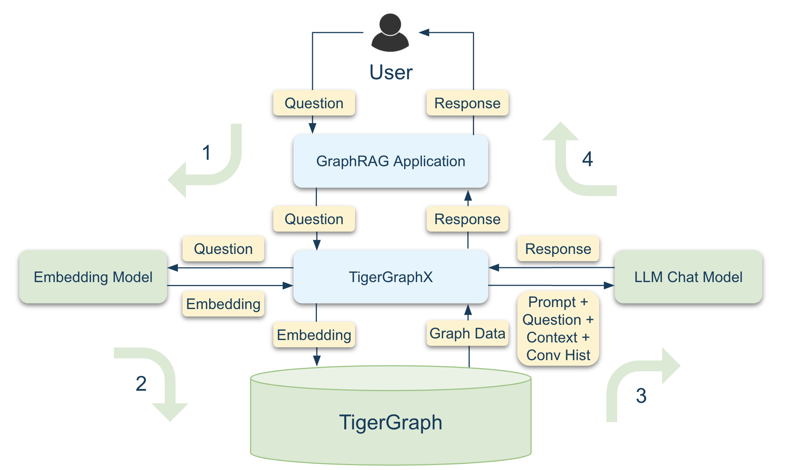

# Supporting Microsoft’s GraphRAG: Part 1

[Microsoft's GraphRAG](https://microsoft.github.io/graphrag/) is a method for creating structured knowledge graphs from raw text, enhancing Retrieval Augmented Generation (RAG) tasks. By organizing information hierarchically, it enables more efficient data retrieval and summarization.

This guide provides a step-by-step walkthrough for integrating **Microsoft's GraphRAG** with **TigerGraph** using **TigerGraphX**. It focuses on utilizing **Microsoft's GraphRAG** for indexing and demonstrates how to use the demo code for **data preprocessing** and **querying** tasks, combining the power of TigerGraphX and TigerGraph.

### What You’ll Learn in This Guide

- **Indexing**: Leverage **Microsoft's GraphRAG** to transform unstructured documents into structured data.
- **Data Preprocessing and Querying**:  Use the provided demo code to import structured data into TigerGraph and perform querying tasks. This involves retrieving data from TigerGraph, building context, and generating answers with an LLM. Note that the **Data Preprocessing** and **Querying** steps operate independently of the GraphRAG package.

|  |  |
|:--------------------------------------------:|:--------------------------------------------:|
|                   Indexing                   |                   Querying                   |

This section explains how to use the demo code without delving into its implementation details. For a deeper understanding of the demo’s implementation or to explore developing your own GraphRAG algorithm with TigerGraph, refer to the [source code](https://github.com/xuanleilin/tigergraphx/tree/main/applications/msft_graphrag). 

---

## Prerequisites

Before proceeding, ensure you’ve completed the installation and setup steps outlined in the [Installation Guide](../getting_started/installation.md), including:

- Setting up Python and TigerGraph. For more details, refer to the [Requirements](../../getting_started/installation/#requirements) section.
- Install TigerGraphX along with its development dependencies. For more details, refer to the [Development Installation](../../getting_started/installation/#development-installation) section.

---

## 1. Indexing (Microsoft GraphRAG)

The indexing process transforms raw documents into structured data using Microsoft’s GraphRAG. Follow these steps to prepare your data:

### 1.1 Data Preparation

#### Create an Input Folder
Create an `input` folder in the `data` directory under `applications/msft_graphrag` to store the documents you want to index. You can specify a different directory by replacing `data` with your desired path.

```bash
mkdir -p data/input
```

#### Add Documents to the Input Folder
Copy your documents (e.g., `fin.txt`) into the `data/input` folder.

---

### 1.2 Initialization

Initialize the indexing system in the `data` directory.

```bash
python3 -m graphrag init --root data
```

---

### 1.3 Set Up OpenAI API Key

GraphRAG requires an OpenAI API key. To configure it:

1. Open the `.env` file in the `data` directory:
   ```bash
   vi data/.env
   ```
2. Add your API key:
   ```bash
   GRAPHRAG_API_KEY=<Your OpenAI API Key>
   ```

#### Optional: Switch to a Cost-Effective Model
GraphRAG uses the `gpt-4-turbo-preview` model by default. To reduce costs, switch to the `gpt-4o-mini` model by editing the `settings.yaml` file in the `data` directory:

```yaml
llm:
  api_key: ${GRAPHRAG_API_KEY}
  type: openai_chat # or azure_openai_chat
  model: gpt-4o-mini # Use a cost-effective model
```

---

### 1.4 Indexing

Run the indexing process to convert documents into structured data. This step uses LLMs and may take several minutes depending on the dataset size and hardware.

```bash
python3 -m graphrag index --no-cache --root data
```

---

## 2. Data Preprocessing

Transform the structured Parquet files generated by GraphRAG into CSV files that TigerGraph can import.

### 2.1 Convert Parquet to CSV

Run the following script to convert Parquet files into TigerGraph-compatible CSV files:

```bash
python3 data_import/convert_parquet_to_tg_csv.py \
--input_dir data/output \
--output_dir data/tg_csv
```

### 2.2 Transfer CSV Files to TigerGraph Server

Transfer the generated CSV files to your TigerGraph server. Use the following command, replacing `username` and `tigergraph-server` with your server credentials:

```bash
scp data/tg_csv/* username@tigergraph-server:/home/tigergraph/data/graphrag
```

---

## 3. Querying

Once the data is imported, you can query it using the `poe graphrag` command. Adjust the mode and query to fit your needs.

### Example 1: Query with Data Loading

The first query should include the `--to_load_data` flag to load the data into TigerGraph.

```bash
poe graphrag --mode local --query "What are the recent developments or products of CytoSorb mentioned in the article?" --to_load_data
```

### Example 2: Query Without Data Loading

Subsequent queries can omit the `--to_load_data` flag for faster execution.

```bash
poe graphrag --mode global --query "What are the key topics discussed in the article?"
```

---

## Next Steps

- [Supporting Microsoft’s GraphRAG: Part 2](msft_graphrag_2.ipynb): Use Jupyter Notebook to explore graph data and perform Graph Analysis.

---

Start transforming your GraphRAG workflows with the power of **TigerGraphX** today!
