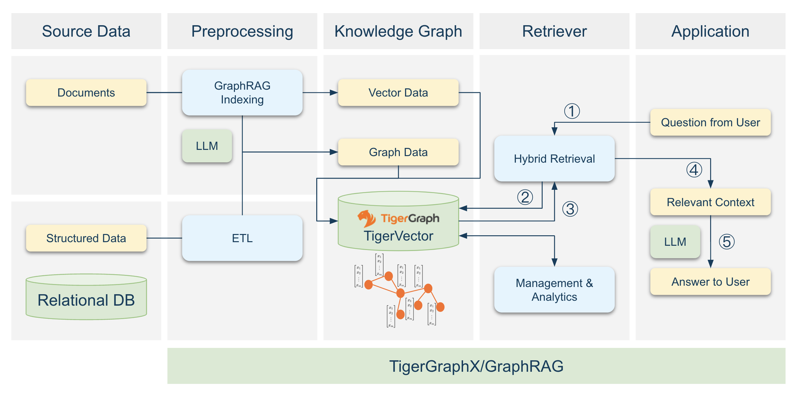

# TigerGraph: Unlocking the Potential of GraphRAG

## Overview

TigerGraph is a highly scalable and efficient graph database, making it the ideal foundation for advanced **GraphRAG** workflows. It excels in handling both graph and vector data, enabling seamless integration and performance at scale. With built-in support for complex queries, multi-hop traversals, and real-time analytics, TigerGraph ensures fast and reliable results. Its versatility and performance make it the ideal choice for powering data-intensive workflows, while **TigerGraphX** simplifies access with a Python-native interface.

---

## Why TigerGraph for GraphRAG?

### **1. Scalability and Performance**

TigerGraph excels in handling massive datasets with high-speed multi-hop queries and vector search capabilities. It is ideal for real-world GraphRAG applications that demand extensive and efficient data processing.

### **2. Unified Graph and Vector Data Support**

With native support for schema-defined nodes, edges, and vectors, TigerGraph streamlines data integration. Its advanced query optimization enables efficient graph traversal and vector-based retrieval, which is perfectly suited for LLM workflows.

### **3. Cost-Effectiveness**

TigerGraph reduces computational overhead through optimized queries and highly efficient storage, significantly cutting infrastructure costs while maintaining top-tier performance.

### **4. Flexibility and Hybrid Integration**

Seamlessly combines structured, semantic, and vector-based retrieval methods in one unified platform. Its compatibility with vector search and LLMs enables advanced hybrid retrieval strategies, unlocking new possibilities for GraphRAG workflows.

---

## GraphRAG Workflow with TigerGraph

### **1. Schema Design**

Define the graph schema with nodes, edges, and attributes tailored to your application, leveraging TigerGraph’s native support for structured graph data.

### **2. Data Preparation and Loading**

Transform raw data into TigerGraph-compatible formats, including graph structures and embeddings, and load it efficiently into TigerGraph using TigerGraphX.

### **3. Knowledge Graph Management and Analysis**
Maintain and enhance the knowledge graph to ensure data quality, relevance, and scalability. Perform in-depth analysis to uncover patterns, infer insights, and optimize data retrieval strategies; ensure the knowledge graph remains a dynamic, accurate, and actionable source of information, enriching context for LLMs while supporting explainability and scalability in the GraphRAG workflow.

### **4. Hybrid Retrieval**

Combine structured queries, semantic search, and vector-based methods to fetch relevant data and embeddings from TigerGraph for context construction.

### **5. Context Building**

Use TigerGraphX to process retrieved data, making it token-aware and formatted to meet the requirements of LLMs.

### **6. LLM Integration**

Pass the context to an LLM to generate responses, enabling advanced GraphRAG workflows with seamless data flow and high efficiency.

---

## Two Options for Implementing GraphRAG with TigerGraph

---

## Next Steps

- Explore a practical use case in [Microsoft GraphRAG: Part 1](msft_graphrag_1.md).

---

Start transforming your GraphRAG workflows with the power of **TigerGraphX** today!
